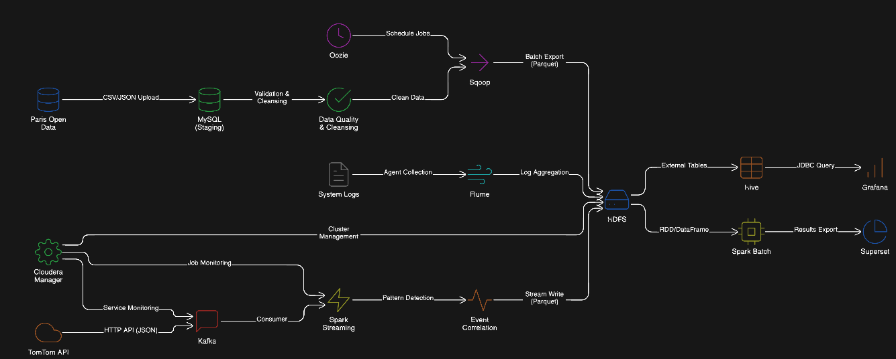

# Big Data Traffic Project

**Historical (Batch) + Real-time (Streaming)**

```
Historical: CSV → PostgreSQL → Sqoop → HDFS
Real-time:  TomTom API → Kafka → Spark → HDFS
```

## Architecture Overview



---

## Historical Data (Batch)

### 1. Start Services
```powershell
docker-compose up -d
```

### 2. Download & Load Data
```powershell
.\scripts\download-data.ps1
cd data-loader
pip install -r requirements.txt
python load_paris_traffic.py ../data/paris_traffic_data.csv
cd ..
```

### 3. Fix Scripts (Windows - First Time)
```powershell
docker exec -it hadoop-master bash -c "sed -i 's/\r$//' /sqoop-scripts/*.sh"
```

### 4. Start Hadoop (First Time)
```powershell
docker exec -it hadoop-master bash -c "./start-hadoop.sh"
```

### 5. Install Sqoop (First Time)
```powershell
docker exec -it hadoop-master bash /sqoop-scripts/install-sqoop.sh
```

### 6. Transfer to HDFS
```powershell
docker exec -it hadoop-master bash /sqoop-scripts/import-traffic-to-hdfs.sh
```

**Result**: 21,928 records in HDFS at `/user/bigdata/traffic/`

---

## Real-time Data (Streaming)

### 1. Install Dependencies
```bash
pip install kafka-python requests pandas pyspark
cd realtime-streaming
chmod +x fix_spark_kafka_connector.sh
./fix_spark_kafka_connector.sh
cd ..
```

### 2. Start Kafka
```bash
docker exec -it hadoop-master bash
./start-kafka-zookeeper.sh
```

### 3. Setup TomTom API Key
Edit `realtime-streaming/produce_incident.py`:
```python
API_KEY = "your_api_key"
```

### 4. Create HDFS Directory
```bash
docker exec -it hadoop-master hdfs dfs -mkdir -p /traffic/incidents
```

### 5. Run Pipeline
**Terminal 1:**
```bash
cd realtime-streaming
python3 produce_incident.py
```

**Terminal 2:**
```bash
cd realtime-streaming
python3 kafka_to_hdfs.py
```

---

## Project Structure

```
Big-Data-Project/
├── docker-compose.yml           # PostgreSQL + Hadoop
├── README.md
├── data/                        # Raw CSV data
├── data-loader/                 # CSV → PostgreSQL
├── postgres-init/               # Database schema
├── scripts/                     # Download scripts
├── sqoop-scripts/               # PostgreSQL → HDFS (Sqoop)
├── realtime-streaming/          # Kafka + Spark streaming
└── docs/                        # Documentation
```

---

## Verify

```bash
# Historical data
docker exec -it hadoop-master hdfs dfs -ls /user/bigdata/traffic/

# Real-time data
docker exec -it hadoop-master hdfs dfs -ls /traffic/incidents/
```

## Web UIs

- HDFS: http://localhost:9870
- YARN: http://localhost:8088

## Stop

```powershell
docker-compose down
```
